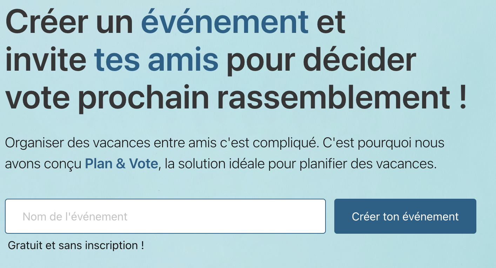
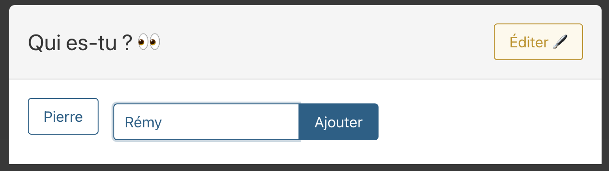
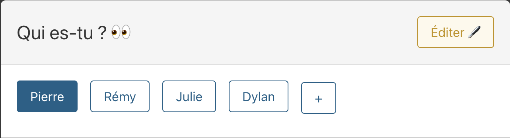
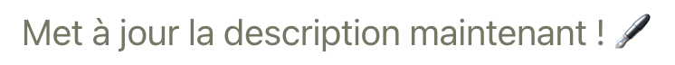
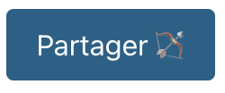
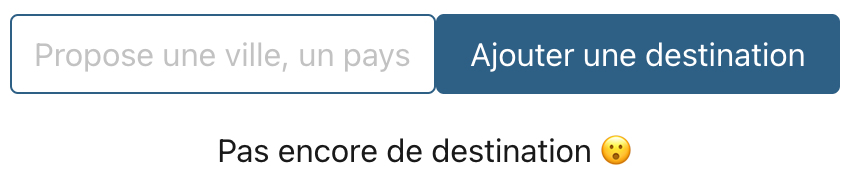
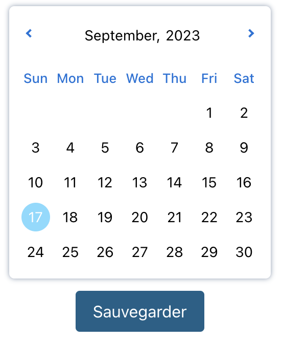

# 🚀 Plan & Vote

[](https://github.com/PlanVoteTeam/PlanVote_Frontend/actions/workflows/main-workflow.yml)
[](https://planvote.netlify.app/)

The objective of **_Plan & Vote_** is to help you in the organisation of your holidays by concentrating only on the essentials, namely: participants, places and slots.
And to accompany you in your decision making.

This project aims to validate our final study project.

#

<details><summary>

## 📒 `User Guide - EN`

  </summary>

This guide will help you easily create and manage your first events on our "Plan & Vote" app, optimizing your group vacations.

<details><summary>

### ⛺️ 1 - Create an Event

  </summary>

#### 1.1 - Define a **_Title_**

Give your event a title to make it easily identifiable by you and other participants.



#### 1.2 - Add **_Participants_**

Add participants by entering their first names or nicknames.



#### 1.3 - Identify Yourself

Specify who you are so that you can perform actions on the event.



#### 1.4 - Define a **_Description_**

Add a brief description to give participants an idea of what the event is about.



#### 1.5 - Define a **_Duration_**

Add a duration to give participants an idea of how long the event will last.


#### 1.6 - **_Share_** the Event

Copy and share the event link with other participants.



#### 1.7 - **_Delete_** a Participant

Copy and share the event link with other participants.


</details>

<details><summary>

### 🏝️ 2 - Interact with the Event

  </summary>

#### 2.1 - Add a **_Destination_**

Suggest various destinations and invite participants to vote for their favorites.



#### 2.2 - Vote for Each **_Destination_**

Vote for each suggested destination.


#### 2.3 - Add a **_Time Slot_**

Indicate your availability and invite participants to do the same to find the best time for everyone.



</details>

<details><summary>

### 🥇 3 - View the Results

  </summary>

#### 3.1 - View the Best **_Destination_**

The system displays the top 3 destinations that received the most votes to facilitate your final choice.


#### 3.2 - View the Best **_Time Slot_**

Find out which time slots are most suitable for the group by looking at the top 3 time slots that received the most votes.


</details>
</details>

#

<details><summary>

## 📒 `Guide d'utilisation - FR`

  </summary>

Ce guide vous permettra de créer et de gérer facilement vos premiers événements sur notre application "Plan & Vote", optimisant ainsi vos vacances en groupe.

</details>

<details><summary>

### ⛺️ 1 - Créer un Événement

  </summary>

#### 1.1 - Définir un **_titre_**

Donnez un titre à votre événement pour qu'il soit facilement identifiable par vous et les autres participants.


#### 1.2 - Ajouter des **_participants_**

Ajoute des participants en entrant leurs prénoms ou surnoms.


#### 1.3 - Identifie toi

Indique qui tu es pour pouvoir effectuer des actions sur l'événement.


#### 1.4 - Définir une **_description_**

Ajoutez une brève description pour donner aux participants une idée de ce que l'événement concerne.


#### 1.5 - Définir une **_durée_**

Ajoutez une durée pour donner aux participants une idée de la durée de l'événement.


#### 1.6 - **_Partager_** l'événement

Copiez et partagez le lien de l'événement avec les autres participants.


#### 1.7 - **_Supprimer_** un participant

Retirer un participant.


</details>

<details><summary>

### 🏝️ 2 - Interagir avec l'Événement

  </summary>

#### 2.1 - Ajout de **_destination_**

Proposez différentes destinations et invitez les participants à voter pour leurs préférées.


#### 2.2 - Vote pour chaque **_destination_**

Votez pour chaque destinations ayant été suggérés.


#### 2.3 - Ajoutez un **_créneau_**

Indiquez vos disponibilités et invitez les participants à faire de même pour trouver le meilleur moment pour tous.


</details>

<details><summary>

### 🥇 3 - Consulter le Résultat

  </summary>

#### 3.1 - Visualisation de la meilleure **_destination_**

Le système affiche le top 3 des destinations ayant reçu le plus de votes pour faciliter votre choix final.


#### 3.2 - Visualisation du meilleur **_créneau_**

Découvrez quelles sont les plages horaires qui conviennent le mieux au groupe en consultant le top 3 des créneaux ayant reçu le plus de votes.


</details>
</details>

#

<details><summary>

## 🏗️ `Getting started`

  </summary>

### install all dependencies

```sh
yarn install
```

### Compile and Hot-Reload for Development

```sh
yarn dev
```

</details>

#

<details><summary>

## 🧑🏽‍💻 `Developpement Context`

  </summary>

### _Team :_

- Pierre Pocheron
- Remy Potus
- Dylan Antonnioti
- Julie Miller

### _Project management :_

- Github Project

### _Project communication :_

- Discord

</details>

#

<details><summary>

## 🧱 `Features`

  </summary>

### ⚓️ `Module Landing`

- Create event

### 🎪 `Module Event`

- 🎭 Display event information
- 👯 Display modal to choose & add participant
- 📩 Share event
- 🏝️ Display list of destinations
- 🏝️ Vote for a destination
- 🏝️ Check the best destination
- ⏳ Define a time slot
- ⏳ View the best time slot

</details>

#

<details><summary>

## 🏛️ `Technology used`

  </summary>

- Web app
- PWA
- Vite
- React
- TypeScript
- [Netlify](https://planvote.netlify.app/)

</details>

